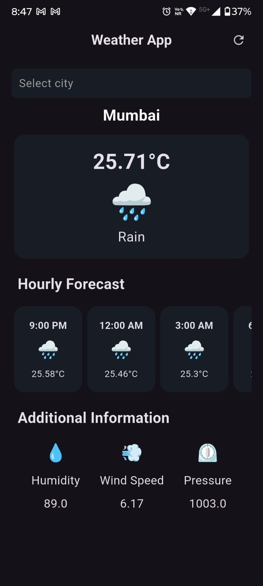
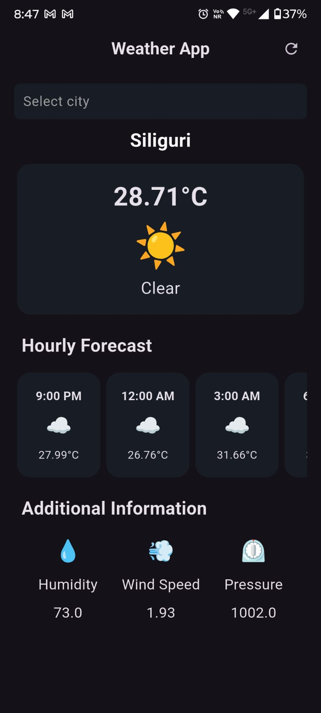

# 🌤️ Weather App

A Flutter-based weather application that displays the **current weather** and **hourly forecast** for selected cities using the OpenWeatherMap API. The app features a simple, responsive, and dark-themed UI.

---

## Features

- Search and select from a list of cities.
- Displays:
  - Current temperature
  - Weather condition with emoji
  - Humidity
  - Wind speed
  - Pressure
- Hourly forecast for the next 10 intervals.
- Pull-to-refresh functionality.
- Autocomplete for city search.
- Clean dark theme and responsive UI.

---

## Screenshots

<p align="center">
  
  
</p>

---

## Getting Started

### Prerequisites

- [Flutter SDK](https://flutter.dev/docs/get-started/install)
- Dart SDK (comes with Flutter)
- OpenWeatherMap API Key ([Get API key](https://openweathermap.org/api))

### Installation

1. Clone the repository:

```bash
git clone <repository-url>
cd weather_app
```

2. Install dependencies:

```bash
flutter pub get
```

3. Add API Key:

Create a file `lib/secrets.dart` (do **not** commit this file to GitHub) and add:

```dart
const String OPEN_WEATHER_API_KEY = 'YOUR_API_KEY_HERE';
```

Replace `'YOUR_API_KEY_HERE'` with your OpenWeatherMap API key.

4. Run the app:

```bash
flutter run
```

---

## Project Structure

```
lib/
├─ main.dart                   # Entry point of the app
├─ weather_screen.dart          # Main screen UI
├─ weather_service.dart         # Handles API requests
├─ additional_item.dart         # Widget for additional weather info
├─ hourly_forecast_item.dart    # Widget for hourly forecast
└─ secrets.dart                 # API key (ignored in git)
```

Other important folders:

```
android/                        # Android native code
ios/                            # iOS native code
assets/                         # Images, icons, and other assets
build/                          # Build output (ignored in git)
```

---

## Dependencies

- [http](https://pub.dev/packages/http) - For making API requests
- [intl](https://pub.dev/packages/intl) - For formatting dates and times
- [flutter_dotenv](https://pub.dev/packages/flutter_dotenv) - For environment variable support (optional)

---

## Usage

- Launch the app.
- Use the autocomplete search to select a city.
- Tap the refresh button to update weather data.
- Scroll horizontally to view hourly forecasts.
- View additional information like humidity, wind speed, and pressure.

---

## Security

- API keys are stored in `lib/secrets.dart` and **never committed** to GitHub.
- `.gitignore` ensures sensitive files and build artifacts are not pushed to the repository.

---

## Future Enhancements

- Add weekly weather forecast.
- Include location-based weather using device GPS.
- Implement dark/light theme toggle.
- Display weather animations based on conditions (rain, snow, sun).

---

## License

This project is open-source and licensed under the MIT License.


